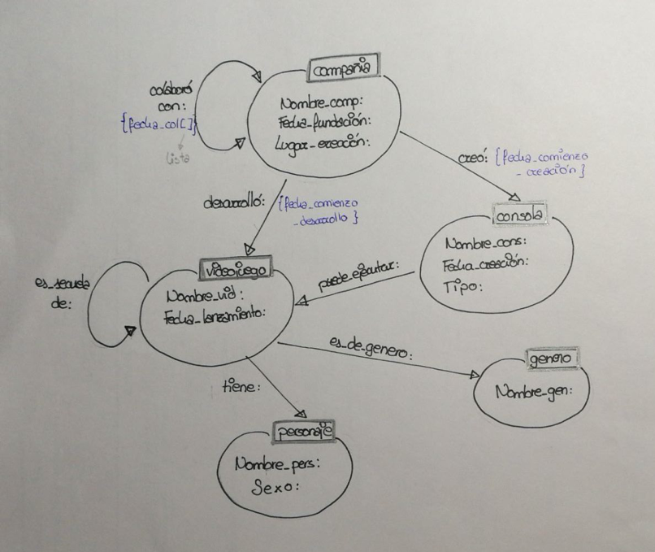
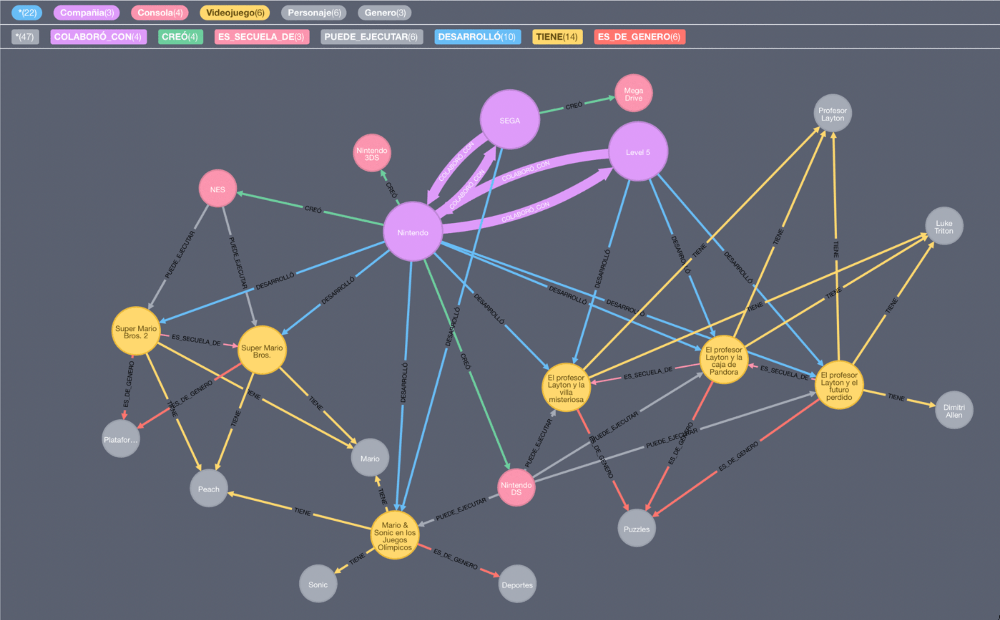

# Neo4j Videojuegos

## Desarrolladores
* Carlos Sanabria Miranda ([@CarlosSanabriaM](https://github.com/CarlosSanabriaM))
* Lucía Méndez López ([@UO250970](https://github.com/UO250970))

## Dominio de aplicación:
La temática de esta base de datos modelada mediante un grafo son los videojuegos.

En ella se representan diversos videojuegos, con los personajes que salen en ellos, las compañías que los desarrollaron, el género al que pertenecen y las consolas para las que salen.

## Modelo de datos


## Instancia de la base de datos


### Nodos
```
x(compañía) -> Nombre_comp; Fecha de fundación; Lugar de creación;
y(videojuego) -> Nombre_vid; Fecha de lanzamiento;
z(personaje) -> Nombre_pers; Sexo;
t(consola) -> Nombre_cons; Fecha de lanzamiento; Tipo(portátil/sobremesa);
p(genero) -> Nombre_gen;
```

### Relaciones
```
1 – x(compañía) -desarrolló {fecha_comienzo_desarrollo:}-> y(videojuego)
2 – y(videojuego) -tiene-> z(personaje)
3 – t(consola) -puede_ejecutar-> y(videojuego)  
4 – y(videojuego) -es_de_genero-> p(genero)  
5 – x(compañía) <-colaboró_con {fecha_colaboración:}-> x(compañía)
6 – y(videojuego) -es_secuela_de-> y(videojuego)
7 – x(compañía) -creó {fecha_comienzo_creación:}-> t(consola)
```

### Explicación de la instancia:
Tenemos 5 compañías: Nintendo, SEGA, Level 5, Eelectronic Arts (EA) y Midway

De Nintendo tenemos 3 de las consolas que ha creado (Nintendo3DS, NintendoDS y NES), así como varios juegos que ha desarrollado (entre ellos "SuperMarioBros" y "SuperMarioBros 2", siendo este último una secuela del primero).

Nintendo ha colaborado con SEGA para desarrollar el videojuego "Mario y Sonic en los juegos Olímpicos", cuyos personajes son Mario (que tambien es personaje de los dos "Super Mario Bros") y Sonic.

SEGA ha creado la Mega Drive. Esta es capaz de ejecutar el videojuego "Mortal Kombat", desarrolado por Midway. Es un juego de lucha, donde uno de los personajes es "Sub-Zero".

Level 5, EA y Midway no han creado ninguna consola.

SEGA colaboró con Nintendo en el desarrollo de los 3 Profesor Layton, siendo "El futuro perdido" secuela directa de "La caja de pandora", y este último secuela directa de "La villa misteriosa".

EA colaboró con Nintendo y SEGA, en el 2002 y el 2000 respectivamente. Aparte, desarrolló el "FIFA 18".

"Mario y Sonic en los JJOO" y "FIFA 18" son un juego de deportes, y los Layton son juegos de puzzles.

Los 5 se pueden ejecutar con la NintendoDS.

Los Super Mario Bros son juegos de plataformas, que se pueden ejecutar con la NES.

## Script de creación de la base de datos
[db-creation-script.sql](db-creation-script.sql)

## Querys de ejemplo
[querys.md](querys.md)
